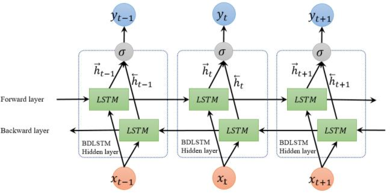

# CoNLL-2003 데이터를 이용한 NER

##### 폴더 구조

```
# folder structure
BLSTM/
	CONFIG/
		POS_TAG_CONFIG.json
		WORDS_CONFIG.json
	dataset/
		test_clean.csv
		test_data.txt
		test_input.npy
		test_input_with_pos.npy
		test_labels.npy
		train_clean.csv
		train_data.txt
		train_input.npy
		train_input_with_pos.npy
		train_labels.npy
	images/
		...
	model/
		model.h5
		model.json
		model_history.json
		model_history_with_pos.json
		model_with_pos.h5
		model_with_pos.json
	module/
		EDA.py
		preprocessing.py
		test.py
	result/
		result.txt
	EDA.ipynb
	preprocessing.py	
	README.md
	simulation.py
	simulation_with_pos.py
	test.py
	test_with_pos.py
	train.py
	train_with_pos.py
```

## 데이터 흐름


1. 데이터는 EDA.ipynb를 통해 txt파일에서 csv파일로 변환된다.
2. preprocessing.py에서 BLSTM 모델에 적합하게 변환되어 npy파일로 저장된다. 이 때, 코퍼스의 단어와 관련된 여러 정보들도 함께 저장된다.
3. train.py에서 npy파일로 저장된 데이터들을 훈련하고 훈련된 모델을 저장한다. 
4. test.py에서 모델의 성능을 측정한다.
5. simulation.py에서 input sentence와 훈련된 모델을 통해 결과를 출력한다.

## EDA

여러 관점에서 데이터를 분석하고, txt파일을 csv파일로 저장한다.

1. text preview
   - 텍스트를 개략적으로 살펴봄으로써 기본적으로 데이터가 어떻게 구성되어있는지, 염두해야하는 부분은 무엇인지 파악한다.
2. number of data
   - 총 데이터의 개수는 14,041개이다. 데이터 수가 많은 편은 아니므로 과적합에 유의해야한다.
3. vocab size
   - 모든 문자를 소문자로 치환하기 전 모든 단어의 개수는 23,623이다.
4. kinds of NER
   - BLSTM의 타겟값으로서 활용하는 각 단어의 NER이다. 총 개수는 10개이다.
5. hist of word count of each sentence
   - 각 문장에 포함된 단어의 개수를 살펴보면 거의 모든 문장이 70개 이하의 단어를 가지고 있다. 
6. describe word count of each sentence
   - 단어의 개수의 통계 지표를 보면 평균이 14개이고 중위값이 10개며 제 3분위수가 22개다. 따라서 input의 단어 개수를 70으로 설정하고 패딩하기로 한다.
7. log hist of count of each word
   - 각 단어의 빈도수를 log화해서 그림을 그려본 결과 각 단어들의 빈도수 차이가 많이 나는 것을 알 수 있다.
8. describe count of each word
   - 각 단어들은 평균적으로 8번 나온다고 하지만 중위수 값이 2번이다. 많은 단어들이 2번 이하로 출현한다는 것을 알 수 있다. 하지만 객체명일 경우 count가 낮을 가능성이 높으므로, min count가 일정 이상되지 않을 때, 'unkown'으로 치환하는게 합리적이다.
9. bar plot of count by NER
   - O에 해당하는 단어가 압도적으로 많다. 정확도로 결과를 측정한다면 오류를 범할 수 있다.

## Preprocessing

전처리 과정에서는 주어진 데이터의 각 문장들의 단어를 숫자로 표현하며 문장의 총 길이가 70 이하가 되도록 패딩한다.

참고 자료에 따르면 pos tag를 함께 학습한다면 좀 더 나은 결과를 있다. pos tag가 포함된 input을 추가로 만든다.

## DeepLearning

### BLSTM 모델



[그림 출처, http://www.gabormelli.com/RKB/Bidirectional_LSTM_(BiLSTM)_Training_System]

- RNN은 뒤로 갈수록 초기 정보가 손실되는 단점이 있다. 이를 보안할 수 있는 모델이 LSTM 모델이다. LSTM은 은닉층의 메모리 셀에 입력 게이트, 망각 게이트, 출력 게이트를 추가하여 불필요한 기억을 지우고, 기억해야할 기억을 유지한다. 따라서 긴 시퀀스의 입력을 처리하는데 좋은 성능을 보인다.

- Bidirectional Recurrent Neural Networks는 과거의 상태뿐만 아니라, 미래의 상태까지 고려하는 확장된 RNN 형태이다.
  - 'Flirty' Princess Diana had Sly Stallone and Richard Gere fighting over her at Elton John's dinner party
  - sly를 해석할 때 뒤를 참조한다면 사람 이름으로 읽을 가능성이 높다.


  [그림 출처, https://en.wikipedia.org/wiki/Long_short-term_memory]

  - 입력 게이트
    - $i_t = \sigma(W_{x_i}x_t + W_{h_i}h_{t-1} + b_i)$
    - $g_t = tanh(W_{x_g}{x_t} + W{h_g}h_{t-1} + b_g)$
    - $i_t$는 현재 기억을 얼마나 가지고 갈지(0과 1사이의 값)
  - 삭제 게이트
    - $f_t = \sigma(W_{x_f}x_t + W_{h_f}h_{t-1} + b_f)$
    - 전 기억을 얼마나 가지고 갈지(0과 1사이의 값)
  - 셀 상태(장기 상태)
    - $C_{t} = f_t \cdot C_{t-1} + i_t \cdot g_t$
  - 출력 게이트와 은닉 상태(단기 상태)
    - $o_t = \sigma(W_{x_o}x_t + W_{h_o}h_{t-1} + b_o)$
    - $h_t = o_t \cdot tanh(c_t)$


### Train

사용한 하이퍼파라미터는 다음과 같다.

```
'max_sentence_length': 70, 
'min_word_count': 5, 
'embedding_size': 64, 
'n_hidden1': 50, 
'n_hidden2': 32, 
'batch_size': 128, 
'epochs': 10
```

프레임 워크는 keras를 사용했다.

##### 실험

- 객체 인식을 해야한다면 대문자가 중요한 역할을 할 것이라 생각되므로 소문자 변환 없이 전처리 후 돌려본다.

### Test

```
Without pos tag
CONFIG: {'max_sentence_length': 70, 'min_word_count': 5, 'embedding_size': 32, 'n_hidden1': 50, 'n_hidden2': 32, 'batch_size': 128, 'epochs': 5}
accuracy: 0.9624664879356568
f1_score: 0.7783641160949868

With pos tag
CONFIG: {'max_sentence_length': 70, 'min_word_count': 5, 'embedding_size': 32, 'n_hidden1': 50, 'n_hidden2': 32, 'batch_size': 128, 'epochs': 5}
accuracy: 0.9705093833780161
f1_score: 0.8124999999999999

Without pos tag
CONFIG: {'max_sentence_length': 70, 'min_word_count': 5, 'embedding_size': 64, 'n_hidden1': 50, 'n_hidden2': 32, 'batch_size': 128, 'epochs': 10}
accuracy: 0.9892761394101877
f1_score: 0.8623087621696801

With pos tag
CONFIG: {'max_sentence_length': 70, 'min_word_count': 5, 'embedding_size': 64, 'n_hidden1': 50, 'n_hidden2': 32, 'batch_size': 128, 'epochs': 10}
accuracy: 0.9865951742627346
f1_score: 0.8927613941018767

Without pos tag and without lowering
CONFIG: {'max_sentence_length': 70, 'min_word_count': 5, 'embedding_size': 64, 'n_hidden1': 50, 'n_hidden2': 32, 'batch_size': 128, 'epochs': 10}
accuracy: 0.9785522788203753
f1_score: 0.8515950069348127

With pos tag and without lowering
CONFIG: {'max_sentence_length': 70, 'min_word_count': 5, 'embedding_size': 64, 'n_hidden1': 50, 'n_hidden2': 32, 'batch_size': 128, 'epochs': 10}
accuracy: 0.9892761394101877
f1_score: 0.872870249017038


```

### Simulation

simulation.py 파일을 실행하고 input sentence를 넣게 되면 input sentence에 사람이름이 있는지 판단하고, 있다면 어느 위치에 있는지 보여준다.

## 개선 방향

- 파일을 분리하면서 데이터를 훈련시키고 예측하며 시뮬레이션 하는 것은 편해졌지만, 워크 프레임 자체를 수정할 때는 굉장히 불편했다.
- 데이터 탐색 파일과 txt 파일을 csv파일로 변환하는 파일을 분리하지 않았다. 한 파일에서 결이 다른 기능을 가지고 있게 하지 않도록 파일 기획을 신경써서 해야한다.
- 참고자료를 읽기 전에 모델링까지 먼저 하느라 POS tag도 활용해야겠다는 생각을 늦게 했다. 선행 자료를 충분히 숙지해야 한다.
- pos tag를 튜플로 저장하지 않고, word_postag 식으로 저장하면 해쉬화하기 쉬웠을 것이다.
- simulation 함수에서 예측하는 것을 함수화하고, while문으로 묶는 것이 더 효율적이다.

